**TLDR** If you aren't interested in understanding the mechanincs of this circular progress bar built without using `svg` or `canvas`, and the only thing you want is to use this component in your React application, just checkout our **[npm package](https://www.npmjs.com/package/@monade/react-circular-progress-bar)**.

# A Circular Progress Bar made only with `<div/>`

Working with curved elements in HTML is not simple, developers usually find themselves having to use elements like `<canvas>` or `<svg>` to accomplish their goals.

For example, an horizontal progress bar is very simple to make in HTML + CSS + JS, however, to make it round, the complexity is much greater.

In this article I'm going to explain how to use only **`<div/>`** elements and some clever **CSS** to build a cool **circular progress bar**.

## 1. How Does It Work?

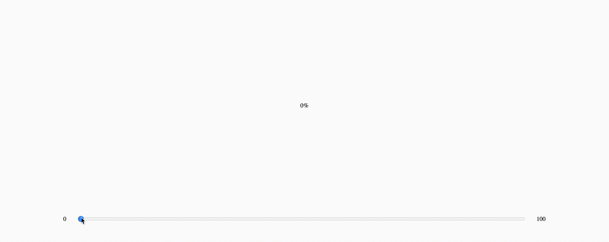

To build a circular progress bar we'll use two important CSS properties:

- **[Clip](https://developer.mozilla.org/en-US/docs/Web/CSS/clip)**: this property allows us to identify a **visibility rectangle** for an element whose position is absolute (es. `clip: rect(1px, 10em, 3rem, 2ch);`). Any children that is not positioned inside the visibility rectangle will not be rendered.
- **[Transform](https://developer.mozilla.org/en-US/docs/Web/CSS/transform)**: this property is very powerful, but we will only use it to **rotate** some elements.

The technique I will show you breaks the circle into two halves, the one on the right (from 0% to 50%) and the one on the left (from 50% to 100%).
To understand more easily how it works, we initially analyze only the right half and then we duplicate the element and apply the same reasoning rotated by 180 degrees to complete the left half as well.

So, for the first half of the circle there are two main elements:

- a square **container** `div`, that contains
- the actual full **circle** `div`.

The container height and width are the same as the circle's ones, like this:

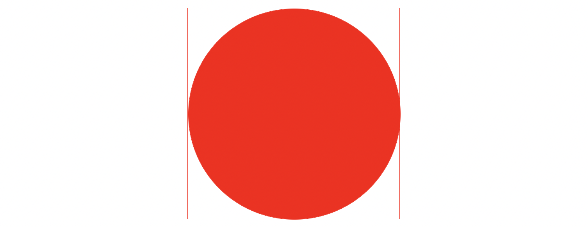

With the **clip** property **applied to the circle** we can hide his right half, obtaining only a left half circle.

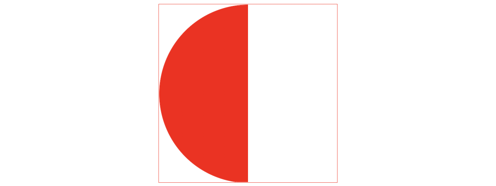

With the **clip** property **applied to the container** we can hide anything that is in the left half and show anything that is in the right half. Since there is nothing to show in the right half we now have an empty square, that secretly hides half a circle.

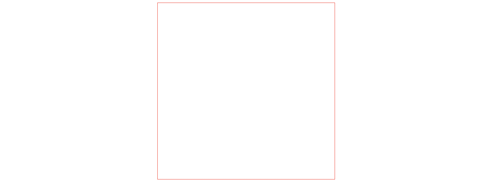

Now, if we slightly rotate the hidden half circle with the **tranform** property, we will see it come out on the right side, like this:

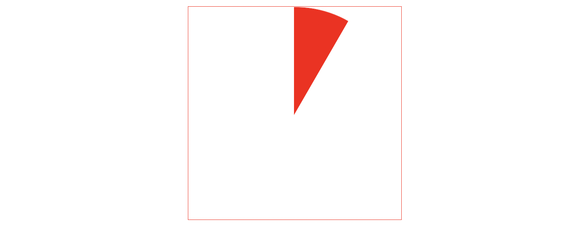

So if we want to show some of the progress we just need to rotare the half colored circle so that it starts to show in the non-clipped right side.

This process only covers the progress of the right half (from 0% to 50%), but if we apply the same reasoning for the other half and we put some logic behind the rotation, we can achieve the illusion of a circular progress bar.

## 2. Let's build it with HTML, CSS and JavaScript

Let's put everything we said in practice with a simple and plain HTML, CSS and JavaScript application.

Feel free to follow along step by step, or if you want to skip to the final solution, you can find all the code that will be used in this section **[here](https://github.com/monade/circular-progress-bar/tree/main/circular-progress-bar-html-css-js)**.

### Step 1: Basic Structure

The first step we'll take is to get all the elements we need in place:

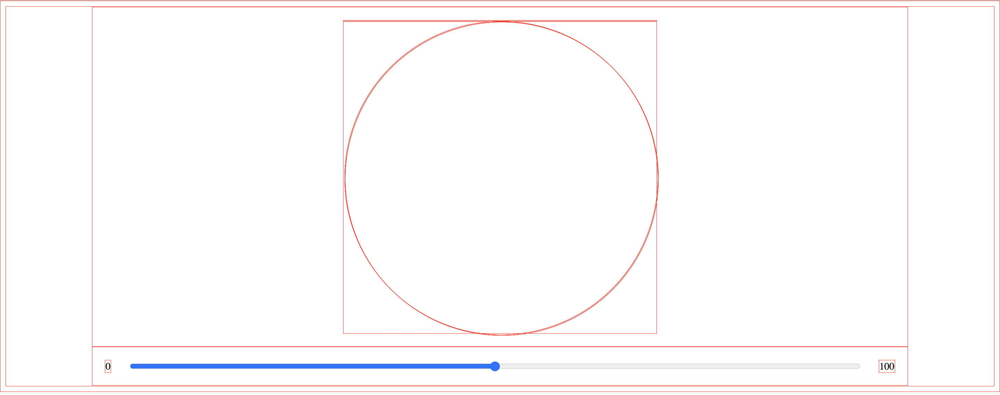

Let's start with a simple `index.html` that contains two main elements:

- a **slider** to control the percentage of progress and
- a **group of `<div/>` elements** that represent the ciruclar progress bar.

<h5 a><strong><code>index.html</code></strong></h5>
```html
<!DOCTYPE html>
<html lang="en">
  <head>
    <meta charset="UTF-8" />
    <meta name="viewport" content="width=device-width, initial-scale=1.0" />
    <title>Circular progress bar</title>
    <link rel="stylesheet" type="text/css" href="./index.css" />
  </head>
  <body>
    <div class="container">
      <div class="circular">
        <div class="circle">
          <div class="bar right">
            <div class="progress"></div>
          </div>
          <div class="bar left">
            <div class="progress"></div>
          </div>
        </div>
      </div>
    </div>
    <div class="container">
      <span>0</span>
      <input id="input-range" type="range" />
      <span>100</span>
    </div>
    <script src="./index.js"></script>
  </body>
</html>
```

Let's better understand what the purpose of each of these `<div/>` elements is:

```html
<div class="bar right">
  <div class="progress" />
</div>
<div class="bar left">
  <div class="progress" />
</div>
```

- The two `<div class="progress" />` are the actual **half-circle elements** that correctly rotated will represent the right-half of the circle (from 0% to 50%) and the left-half of the circle (from 50% to 100%).
- `<div class="bar right">` and `<div class="bar left">` are the two **containers** we were talking about in the previous section. Their purpose is to use the clip css property to hide and show their children elements.

Now let's apply some basic css to get everything in place:

<h5 a><strong><code>index.css</code></strong></h5>

```css
/* this css rule is used only to help us with visual debug */
* {
  border: 1px solid red;
}

body {
  display: flex;
  flex-direction: column;
  justify-content: center;
  align-items: center;
}

.container {
  width: 80%;

  display: flex;
  justify-content: center;
  align-items: center;

  padding: 20px;
}

.container input {
  width: 100%;
  margin: 0px 30px;
}

.circular {
  position: relative;
  margin: 0;
  padding: 0;

  /*
  * Diameter of the circle: 500px, 
  * we'll fix the fact that this value is hardcoded later 
  */
  height: 500px;
  width: 500px;
}

.circular .bar {
  position: absolute;
  height: 100%;
  width: 100%;
  border-radius: 50%;
}

.circle .bar .progress {
  position: absolute;
  height: 100%;
  width: 100%;
  border-radius: 50%;
}
```

All this css is pretty straight forward, the only things to note are:

- `* { border: 1px solid red; }` is used only for visual debug purpose
- in the `.circular { /*...*/ }` rule we hardcode the height and the width to match the diamater of the circle of the progress bar we are going to create, but this is only temporary, we'll remove it later.

All that is left is some basic JavaScript:

<h5 a><strong><code>index.js</code></strong></h5>
```js
/** 
 * Waits for the document to be ready before running our js
 */
function docReady(fn) {
  if (document.readyState === "complete" 
      || document.readyState === "interactive") {
    setTimeout(fn, 1);
  } else {
    document.addEventListener("DOMContentLoaded", fn);
  }
}
docReady(init);

function init() {
// set up will happen here...

makeProgressBarInteractive();
}

function makeProgressBarInteractive() {
let inputRef = document.getElementsByTagName("input")[0];
inputRef.addEventListener("input", updateCiruclarProgressBar);
}

/\*\*

- Here we'll make every necessary update to make the progress
- bar match the slider percentage value
  \*/
  function updateCiruclarProgressBar(event) {
  console.log(event.target.value);

// fix the rotation of the circles to match the slider value...
}

````

### Step 2: Clip

The next step is to define a diameter in pixels and a color for our circles:

```js
const DIAMETER = 500;
const COLOR = "#ff0000";
````

Now the `init` function will get the references of all the `<div/>` elements and set up the **background-color** and the **clip** properties:

```js
let inputRef = null;
let rightBar = null;
let leftBar = null;
let rightProgress = null;
let leftProgress = null;

function init() {
  rightBar = document.getElementsByClassName("bar")[0];
  leftBar = document.getElementsByClassName("bar")[1];
  rightProgress = document.getElementsByClassName("progress")[0];
  leftProgress = document.getElementsByClassName("progress")[1];

  // clip the right part of the circle
  rightBar.style.clip = `rect(0px, ${DIAMETER}px, ${DIAMETER}px, ${DIAMETER / 2}px)`;
  // clip the left part of the circle
  rightProgress.style.clip = `rect(0px, ${DIAMETER / 2}px, ${DIAMETER}px, 0px)`;

  // clip the left part of the cicle
  leftBar.style.clip = `rect(0px, ${DIAMETER / 2}px, ${DIAMETER}px, 0px)`;
  // clip the right part of the circle
  leftProgress.style.clip = `rect(0px, ${DIAMETER}px, ${DIAMETER}px, ${DIAMETER / 2}px)`;

  // set background color
  rightProgress.style.backgroundColor = `${COLOR}`;
  leftProgress.style.backgroundColor = `${COLOR}`;

  makeProgressBarInteractive();
}
```

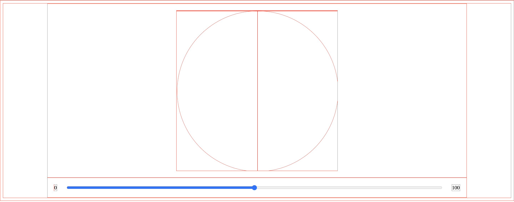

### Step 3: Rotate

Now the fun part! Let's rotate the `rightProgress` and `leftProgress` elements accordingly to the percentage value of the slider.

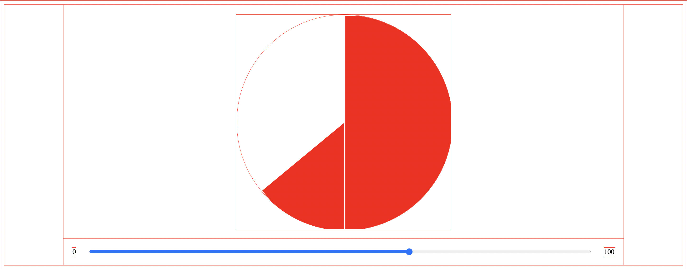

```js
function makeProgressBarInteractive() {
  inputRef = document.getElementsByTagName("input")[0];

  inputRef.addEventListener("input", updateCiruclarProgressBar);
}

function updateCiruclarProgressBar(event) {
  // percentage value is get from the slider
  const percentage = event.target.value / 100;

  // the right side of the circle handles the progress from 0% up to 50%
  // if the progress is over 50% then the rotation will max at 180 degrees
  rightProgress.style.transform = `rotate(${percentage < 0.5 ? percentage * 2 * 180 : 180}deg)`;

  // the left side of the circle handles the progress from 50% up to 100%
  // if the progress is under 50% then the rotation will be of 0 degrees.
  leftProgress.style.transform = `rotate(${percentage > 0.5 ? percentage * 2 * 180 + 180 : 0}deg)`;
}
```

An important thing to note is that the `leftProgress` element must start to rotate only when the percentage of progress reaches 50%, on the other side, the `rightProgress` element must stop his rotation when the percentage of progress reaches 50%.

### Step 4: Polishing the details

To have a beautiful circle all that is left to do is to get rid of the `* { border: 1px solid red; }` property:

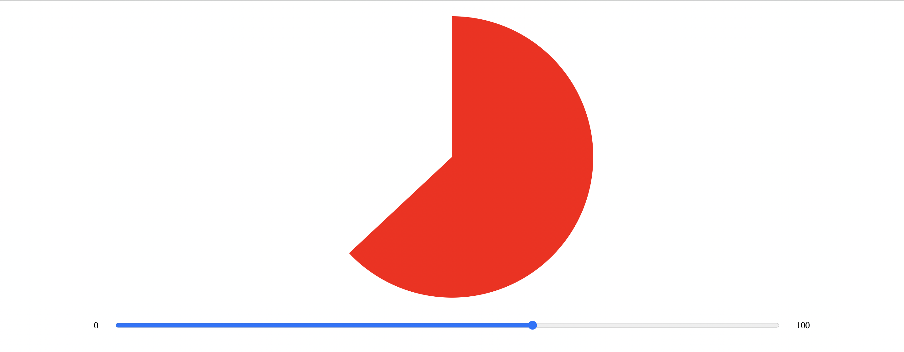

We also need to handle with JavaScript the question of the height and width that was initially hardcoded in the css.

```css
.circular {
  /*...*/
  /* remove -> height: 500px; */
  /* remove -> width: 500px; */
}
```

```js
let circularRef = null;

function init() {
  circularRef = document.getElementsByClassName("circular")[0];
  circularRef.style.height = DIAMETER + "px";
  circularRef.style.width = DIAMETER + "px";

  //...
}
```

At the end our JavaScript file will look like this:

```js
const DIAMETER = 500;
const COLOR = "#ff0000";

let inputRef = null;
let rightBar = null;
let leftBar = null;
let rightProgress = null;
let leftProgress = null;
let circularRef = null;

function makeProgressBarInteractive() {
  inputRef = document.getElementsByTagName("input")[0];

  inputRef.addEventListener("input", updateCiruclarProgressBar);
  inputRef.value = 0;
}

function init() {
  circularRef = document.getElementsByClassName("circular")[0];
  circularRef.style.height = DIAMETER + "px";
  circularRef.style.width = DIAMETER + "px";

  rightBar = document.getElementsByClassName("bar")[0];
  leftBar = document.getElementsByClassName("bar")[1];
  rightProgress = document.getElementsByClassName("progress")[0];
  leftProgress = document.getElementsByClassName("progress")[1];

  rightBar.style.clip = `rect(0px, ${DIAMETER}px, ${DIAMETER}px, ${DIAMETER / 2}px)`;
  rightProgress.style.clip = `rect(0px, ${DIAMETER / 2}px, ${DIAMETER}px, 0px)`;

  leftBar.style.clip = `rect(0px, ${DIAMETER / 2}px, ${DIAMETER}px, 0px)`;
  leftProgress.style.clip = `rect(0px, ${DIAMETER}px, ${DIAMETER}px, ${DIAMETER / 2}px)`;

  rightProgress.style.backgroundColor = `${COLOR}`;
  leftProgress.style.backgroundColor = `${COLOR}`;

  makeProgressBarInteractive();
}

function updateCiruclarProgressBar(event) {
  const percentage = event.target.value / 100;
  rightProgress.style.transform = `rotate(${percentage < 0.5 ? percentage * 2 * 180 : 180}deg)`;
  leftProgress.style.transform = `rotate(${percentage > 0.5 ? percentage * 2 * 180 + 180 : 0}deg)`;
}

function docReady(fn) {
  if (document.readyState === "complete" || document.readyState === "interactive") {
    setTimeout(fn, 1);
  } else {
    document.addEventListener("DOMContentLoaded", fn);
  }
}
docReady(init);
```

### Step 5: Content inside the circle

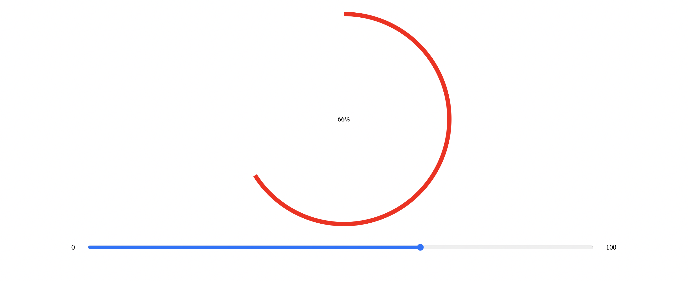

Now that we have a full circle that fills up based on a percentage, the next step would be to put some content inside the circle. I have decided to simply show a slightly smaller circle colored as the background (white) with the percentage written in the center.

<h5 a><strong><code>index.html</code></strong></h5>
```html
<div class="container">
  <div class="circular">
    <div class="circle">
      <div class="bar right">
        <div class="progress"></div>
      </div>
      <div class="bar left">
        <div class="progress"></div>
      </div>
    </div>
  </div>
  <div class="content">
    <span>0%</span>
  </div>
</div>
<div class="container">
  <span>0</span>
  <input id="input-range" type="range" />
  <span>100</span>
</div>
```

<h5 a><strong><code>index.css</code></strong></h5>

```css
.content {
  position: absolute;
  z-index: 1000;

  display: flex;
  justify-content: center;
  align-items: center;

  border-radius: 50%;
}
```

<h5 a><strong><code>index.js</code></strong></h5>

```js
const BORDER_WIDTH = 20;
const BACKGROUND_COLOR = "#ffffff";

let content = null;

// ...

function init() {
  // ...

  content = document.getElementsByClassName("content")[0];
  content.style.height = DIAMETER - BORDER_WIDTH + "px";
  content.style.width = DIAMETER - BORDER_WIDTH + "px";
  content.style.backgroundColor = BACKGROUND_COLOR;

  // ...
}

function updateCiruclarProgressBar(event) {
  // ...

  content.firstElementChild.innerHTML = `${event.target.value}%`;
}
```

The final result looks like this:


## 4. Let's make it in React

Now that we have a good understangind of the mechanics behind this circular progress bar, let's wrap everything we have said so far in a **React component**.

We want the react component to be **as customizable as possible** throught props:

- **percentage of progress**
- **diameter**
- **color**
- **border width**
- **content background color**
- **content as a child**


**Note**: this component is **typescript friendly**.

<h5 a><strong><code>circularProgressBar.tsx</code></strong></h5>

```ts
import { MutableRefObject, useEffect, useRef } from "react";
import "./circularProgressBar.css";

interface circularProgressBarPropsInterface {
  color: string;
  diameter: number;
  percentage: number;
  borderWidth?: number;
  contentBackgroundColor?: string;
  className?: string;
  contentClassName?: string;
  children?: JSX.Element;
}

export default function CircularProgressBar({
  color,
  diameter,
  percentage,
  borderWidth,
  contentBackgroundColor,
  className,
  contentClassName,
  children,
}: circularProgressBarPropsInterface) {
  const rightBar = useRef<HTMLDivElement>(null) as MutableRefObject<HTMLDivElement>;
  const rightProgress = useRef<HTMLDivElement>(null) as MutableRefObject<HTMLDivElement>;
  const leftBar = useRef<HTMLDivElement>(null) as MutableRefObject<HTMLDivElement>;
  const leftProgress = useRef<HTMLDivElement>(null) as MutableRefObject<HTMLDivElement>;
  const content = useRef<HTMLDivElement>(null) as MutableRefObject<HTMLDivElement>;

  // setup dimensions, colors, and clip properties
  useEffect(() => {
    if (borderWidth) {
      content.current.style.height = diameter - borderWidth + "px";
      content.current.style.width = diameter - borderWidth + "px";
    }

    if (contentBackgroundColor) {
      content.current.style.backgroundColor = contentBackgroundColor;
    }

    rightBar.current.style.clip = `rect(0px, ${diameter}px, ${diameter}px, ${diameter / 2}px)`;
    rightProgress.current.style.clip = `rect(0px, ${diameter / 2}px, ${diameter}px, 0px)`;

    leftBar.current.style.clip = `rect(0px, ${diameter / 2}px, ${diameter}px, 0px)`;
    leftProgress.current.style.clip = `rect(0px, ${diameter}px, ${diameter}px, ${diameter / 2}px)`;

    rightProgress.current.style.backgroundColor = `${color}`;
    leftProgress.current.style.backgroundColor = `${color}`;
  }, [color, diameter, borderWidth, contentBackgroundColor]);

  // handles the rotation
  useEffect(() => {
    if (!percentage) {
      rightProgress.current.style.transform = `rotate(0deg)`;
      leftProgress.current.style.transform = `rotate(0deg)`;
      return;
    }

    let floatPercentage = percentage / 100;
    rightProgress.current.style.transform = `rotate(${floatPercentage < 0.5 ? floatPercentage * 2 * 180 : 180}deg)`;
    leftProgress.current.style.transform = `rotate(${floatPercentage > 0.5 ? floatPercentage * 2 * 180 + 180 : 0}deg)`;
  }, [percentage]);

  return (
    <div className={`container ${className ?? ""}`}>
      <div className='circular' style={{ height: diameter, width: diameter }}>
        <div className='circle'>
          <div className='bar right' ref={rightBar}>
            <div className='progress' ref={rightProgress} />
          </div>
          <div className='bar left' ref={leftBar}>
            <div className='progress' ref={leftProgress} />
          </div>
        </div>
      </div>
      <div className={`content ${contentClassName ?? ""}`} ref={content}>
        {children}
      </div>
    </div>
  );
}
```

<h5 a><strong><code>circularProgressBar.css</code></strong></h5>

```css
.container {
  display: flex;
  justify-content: center;
  align-items: center;
  padding: 20px;
}

.circular {
  position: relative;
  margin: 0;
  padding: 0;
}

.circular .bar {
  position: absolute;
  height: 100%;
  width: 100%;
  border-radius: 50%;
}

.circle .bar .progress {
  position: absolute;
  height: 100%;
  width: 100%;
  border-radius: 50%;
}

.content {
  position: absolute;
  z-index: 1000;

  display: flex;
  justify-content: center;
  align-items: center;

  border-radius: 50%;
}
```

## 3. npm package

If you want to use this circular progress bar in your react application we have a **[npm package](https://link.to.thingy)** for you.

First we need to install the package with **npm**:
```
npm install @monade/react-circular-progress-bar
```
or with **yarn**:
```
yarn add @monade/react-circular-progress-bar
```

Then we just need to **import** and **use** it like this:

```js
import { CircularProgressBar } from '@monade/react-circular-progress-bar'
```
```html
<CircularProgressBar
  diameter={...}
  color={...}
  percentage={...}
  borderWidth={...}
  contentBackgroundColor={...}
  className={...}
  contentClassName={...}
>
  <span>{...}</span>
</CircularProgressBar>
```

## 4. Use case: Hippopod's Player

My journey through the problem of circular progress bars in web development started when I was working on **Hippopod**, an open source project that transform an RSS feed into a static podcast websites.

During the development I found myself having to develop an audio player, whose play / pause button component had to take care of showing the progress of the track being played like this:

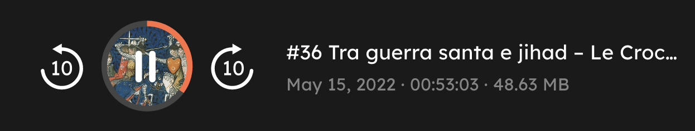

If you are interested in what Hippopod is, check it out at **[hippopod.xyz](https://hippopod.xyz/)**